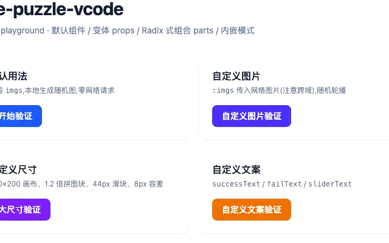

# vue-puzzle-vcode [](https://www.npmjs.com/package/vue-puzzle-vcode) [](https://www.npmjs.com/package/vue-puzzle-vcode)

Vue 纯前端的拼图人机验证、右滑拼图验证。不依赖任何第三方 SDK 与后端接口,纯 Canvas 本地生成校验。

**同时支持 Vue 2.7 与 Vue 3**(基于 [vue-demi](https://github.com/vueuse/vue-demi),`vue` 为 peer dependency,不会向你的项目引入第二个 Vue)。

**DEMO**: https://isluo.com/work/vue-puzzle-vcode/



## 特性

- 🔀 一套代码同时跑在 Vue 2.7 与 Vue 3 上
- 🧩 Radix 风格的组合式部件:`VcodeRoot` 提供上下文,`VcodeOverlay` / `VcodeSlider` 等部件通过 `inject` 接入,每一层都可替换、可自定义 slot
- 🎛 Headless 状态机 `useVcode`:逻辑与视图完全解耦,可完全自建 UI
- 🖼 无图模式下用 Canvas 随机生成背景图,也可以传入自己的图片数组
- 📦 `vue` 仅作为 peer dependency,杜绝双 Vue 问题

## 安装

```bash
pnpm add vue-puzzle-vcode
# npm i vue-puzzle-vcode / yarn add vue-puzzle-vcode
```

项目需已安装 `vue@^2.7 || ^3`(peer dependency)。`vue-demi` 会在安装时自动切换到与你项目匹配的版本。

## 快速开始(默认组件)

### Vue 3

```vue
<script setup>
import { ref } from 'vue'
import Vcode from 'vue-puzzle-vcode'
import 'vue-puzzle-vcode/style.css'

const show = ref(false)
</script>

<template>
  <button @click="show = true">验证</button>
  <Vcode
    v-model:show="show"
    :imgs="['https://picsum.photos/seed/a/310/160']"
    @success="(diff) => console.log('通过', diff)"
    @fail="(diff) => console.log('失败', diff)"
  />
</template>
```

### Vue 2.7

模板写法的唯一区别:用 `.sync` 代替 `v-model:show`。

```vue
<script>
import Vcode from 'vue-puzzle-vcode'
import 'vue-puzzle-vcode/style.css'

export default {
  components: { Vcode },
  data: () => ({ show: false }),
}
</script>

<template>
  <Vcode :show.sync="show" @success="onSuccess" @fail="onFail" />
</template>
```

也可以 `app.use(VcodePlugin)`(Vue 2.7 用 `Vue.use(VcodePlugin)`)全局注册全部部件。

## Props

| Prop          | 类型       | 默认值               | 说明                                  |
| ------------- | ---------- | -------------------- | ------------------------------------- |
| `show`        | `boolean`  | `false`              | 显隐,受控;配合 `v-model:show` / `.sync` |
| `canvasWidth` | `number`   | `310`                | 主画布宽                               |
| `canvasHeight`| `number`   | `160`                | 主画布高                               |
| `puzzleScale` | `number`   | `1`                  | 拼图块缩放,钳制在 `0.2 ~ 2`           |
| `sliderSize`  | `number`   | `50`                 | 滑块尺寸                               |
| `range`       | `number`   | `10`                 | 判定成功的允许像素误差                 |
| `imgs`        | `string[]` | `undefined`          | 自定义背景图;缺省时 Canvas 随机生成   |
| `successText` | `string`   | `验证通过！`          | 成功提示文案                           |
| `failText`    | `string`   | `验证失败，请重试`    | 失败提示文案                           |
| `sliderText`  | `string`   | `拖动滑块完成拼图`    | 滑轨文案                               |

## Events

| 事件          | 参数            | 说明                                   |
| ------------- | --------------- | -------------------------------------- |
| `update:show` | `show: boolean` | 组件请求关闭(点遮罩 / 验证通过后自动关闭) |
| `success`     | `diff: number`  | 验证通过,`diff` 为像素偏差            |
| `fail`        | `diff: number`  | 验证失败(800ms 后自动重置)           |
| `close`       | —               | 请求关闭(与 `update:show(false)` 同步触发) |

## 默认组件的 Slots

`<Vcode>` 内部就是一套默认组合,以下插槽可逐块替换:

| Slot          | 作用域参数            | 说明                 |
| ------------- | --------------------- | -------------------- |
| `loading`     | —                     | 加载动画区域         |
| `message`     | `{ text, fail }`      | 顶部提示条           |
| `refresh`     | —                     | 右上角刷新按钮内容   |
| `thumb`       | —                     | 滑块手柄内容         |
| `slider-text` | —                     | 滑轨文字             |

## 组合式部件(Radix 风格)

想要完全自定义某一层?用部件自行组合。`VcodeRoot` 创建状态机并 `provide` 上下文,其余部件通过 `inject` 接入,任意一层都可以换成你自己的实现:

```vue
<script setup>
import {
  VcodeRoot, VcodePortal, VcodeOverlay, VcodePanel, VcodeBoard,
  VcodeCanvasMain, VcodeCanvasPuzzle, VcodeCanvasSuccess,
  VcodeFlash, VcodeLoading, VcodeMessage, VcodeRefresh,
  VcodeSlider, VcodeSliderProgress, VcodeSliderThumb,
} from 'vue-puzzle-vcode'
</script>

<template>
  <VcodeRoot v-model:show="show" @success="ok" @fail="bad">
    <VcodePortal>
      <!-- 遮罩:随便加自己的 class / 过渡 -->
      <VcodeOverlay class="bg-slate-900/60 backdrop-blur-sm" />
      <VcodePanel>
        <VcodeBoard>
          <VcodeCanvasMain />
          <VcodeCanvasSuccess />
          <VcodeCanvasPuzzle />
          <VcodeLoading />
          <VcodeFlash />
          <VcodeRefresh>
            <button class="my-refresh">↻</button>
          </VcodeRefresh>
          <VcodeMessage v-slot="{ text, fail }">
            <div :class="fail ? 'msg msg--fail' : 'msg'">{{ text }}</div>
          </VcodeMessage>
        </VcodeBoard>
        <VcodeSlider>
          <VcodeSliderProgress />
          <VcodeSliderThumb><span>⇥</span></VcodeSliderThumb>
        </VcodeSlider>
      </VcodePanel>
    </VcodePortal>
  </VcodeRoot>
</template>
```

默认导出 `<Vcode>` 就是以上部件的一套官方组合,二者 API(props / events)完全一致。

## 部件说明

默认组合的嵌套结构(缩进 = 父子关系):

```
Vcode                    默认整体组件 = 下面这棵树的官方封装
└─ VcodeRoot             [必需] 无渲染根:创建状态机、provide 上下文、
   │                     绑定 document 级拖拽监听、show 时锁 body 滚动
   └─ VcodePortal        把子树挂到 document.body(Vue2 安全的 Teleport)
      ├─ VcodeOverlay    全屏遮罩;按下并抬起都在遮罩上 → 请求关闭
      └─ VcodePanel      居中卡片;拦截指针事件,防止冒泡到遮罩误关
         ├─ VcodeBoard   画布区容器(高度跟随 canvasHeight)
         │  ├─ VcodeCanvasMain     主画布:带拼图缺口的背景图
         │  ├─ VcodeCanvasSuccess  完整图,验证成功时淡入
         │  ├─ VcodeCanvasPuzzle   拼图小块,translateX 跟随滑块
         │  ├─ VcodeLoading        图片加载中的遮罩动画
         │  ├─ VcodeFlash          验证成功时的斜向扫光
         │  ├─ VcodeRefresh        右上角刷新按钮(点击重新生成拼图)
         │  └─ VcodeMessage        结果提示条(绿=成功 / 红=失败)
         └─ VcodeSlider            滑轨容器,含提示文案
            ├─ VcodeSliderProgress 已拖动部分的填充条
            └─ VcodeSliderThumb    可拖拽手柄(mousedown/touchstart 起点)
```

逐件说明:

| 组件 | 作用 | 根 class | Slot |
| --- | --- | --- | --- |
| `Vcode` | 默认整体组件,props/events 与 `VcodeRoot` 相同;额外暴露 `reset()`(对齐 v1 的 `$refs.vcode.reset()`) | — | `loading` / `message({text,fail})` / `refresh` / `thumb` / `slider-text` |
| `VcodeRoot` | **组合式用法的必需根**。运行 `useVcode` 状态机并 `provide` 上下文;负责 `document` 上的 move/up 监听、`show` 变化时重置拼图、打开时给 body 加 `vpv-body-lock` 禁滚 | `display:contents` | 默认 slot(放各部件) |
| `VcodePortal` | mount 时把子 DOM 移到 `document.body`,unmount 时移除;`to` prop 可换挂载目标(选择器或元素) | `vpv-portal` | 默认 slot |
| `VcodeOverlay` | 全屏遮罩层。按下与抬起**都落在遮罩上**才触发 `requestClose`(防误触);`show` 时加 `--show` 修饰类做淡入 | `vpv-overlay` | 默认 slot |
| `VcodePanel` | 居中白色卡片容器。对 `mousedown/touchstart` 做 `stopPropagation`,让卡片内的点击不会关闭验证码 | `vpv-panel` | 默认 slot |
| `VcodeBoard` | 上半部分画布区,行内高度 = `canvasHeight` | `vpv-board` | 默认 slot |
| `VcodeCanvasMain` | 主画布:绘制背景图 + 拼图缺口。mount 时把元素注册进状态机(`registerCanvas('main')`) | `vpv-canvas-main` | — |
| `VcodeCanvasSuccess` | 无缺口的完整图,初始透明;`isSuccess` 时加 `--show` 淡入 | `vpv-canvas-success` | — |
| `VcodeCanvasPuzzle` | 浮动的拼图小块,`translateX` 随拖动实时更新,宽度 = `puzzleBaseSize` | `vpv-canvas-puzzle` | — |
| `VcodeLoading` | 图片加载期间的全覆盖动画层,`loading=false` 时加 `--hide`;默认渲染 5 点弹跳 spinner | `vpv-loading` | 默认 slot 替换 spinner |
| `VcodeFlash` | 成功瞬间从左到右扫过的斜切高光(`skew(-30deg)`),纯装饰 | `vpv-flash` | — |
| `VcodeRefresh` | 点击调用状态机 `reset()` 重新生成拼图;默认渲染内置 SVG 刷新图标 | `vpv-refresh` | 默认 slot 替换按钮内容 |
| `VcodeMessage` | 顶部结果提示条,显示 `infoText`;失败加 `--fail` 变红。**slot scope:`{ text, fail }`** | `vpv-message` | 默认 slot(带 scope) |
| `VcodeSlider` | 滑轨容器,行内高度 = `sliderSize`;渲染提示文案 + 默认 slot 内容 | `vpv-slider` | 默认 slot;`text` slot 替换文案 |
| `VcodeSliderProgress` | 已拖动部分的填充条,宽度跟随 `styleWidth`;**它注册的元素是状态机在按下时测量轨道宽度的基准** | `vpv-slider-progress` | 默认 slot |
| `VcodeSliderThumb` | 可拖拽手柄,`mousedown/touchstart` 触发 `onThumbDown` 开始拖动;按住时加 `--down`;默认渲染 3 道握把纹 | `vpv-slider-thumb` | 默认 slot 替换手柄内容 |

**功能核心 vs 可替换装饰**:三个 `VcodeCanvas*`、`VcodeSliderProgress`、`VcodeSliderThumb` 是状态机直接依赖的功能件(画布要被绘制、progress 元素要被测量、thumb 是拖拽起点),替换它们时必须保留注册/事件契约;`Overlay` / `Panel` / `Flash` / `Loading` / `Message` / `Refresh` 是纯表现层,可随意删改。

## Headless:`useVcode` 状态机

连部件都不想用?直接从 `@vue-puzzle-vcode/core` 拿状态机,自己渲染:

```ts
import { useVcode, provideVcodeContext } from 'vue-puzzle-vcode'

// 在根组件 setup 中
const ctx = useVcode(props, {
  onSuccess: (diff) => {},
  onFail: (diff) => {},
  onClose: () => {},
})
provideVcodeContext(ctx) // 之后任意后代组件 useVcodeContext() 取回
```

返回值为全部响应式状态(`pinX` / `pinY` / `styleWidth` / `loading` / `isSuccess` …)、三个 canvas 的 `shallowRef` 句柄,以及 `onThumbDown` / `onPointerMove` / `onPointerUp` / `requestClose` / `reset` 等行为函数。

## 样式

组件样式与框架解耦,按需引入:

```ts
import 'vue-puzzle-vcode/style.css'
```

所有 class 以 `vpv-` 为前缀(如 `.vpv-overlay`、`.vpv-slider-thumb`),方便覆写;组合式用法下也可以完全不管它,全部自己写。

## 仓库结构(pnpm monorepo)

```
packages/
  shared/   # 纯 TS 工具:Canvas 拼图生成、几何计算(tsdown 构建)
  core/     # Headless:useVcode 状态机、上下文、hCompat、事件监听(tsdown 构建)
  vue/      # 组件包:默认组件 + 全部组合式部件(vite 构建,产物 ESM+CJS+d.ts)
playgrounds/
  vue2/     # Vue 2.7 + Vite 验证场
  vue3/     # Vue 3 + Vite + Tailwind CSS 4 验证场
fixtures/
  typecheck-vue2/  # 以真实消费者形态(打包产物 + skipLibCheck:false)
  typecheck-vue3/  # 分别对 Vue 2.7 / Vue 3 做类型契约测试
```

### 本地开发

```bash
pnpm install        # 需要 pnpm 11
pnpm dev:vue2       # 启动 Vue 2.7 playground
pnpm dev:vue3       # 启动 Vue 3 playground
pnpm build          # 构建全部包
pnpm typecheck      # 全部包 + playground 类型检查
pnpm test:types     # 消费者契约测试:打包→安装→双版本类型检查
```

## 发布（CI/CD）

CI(`.github/workflows/ci.yml`)：push / PR 时跑 `typecheck` → `build` → `test:types`（消费者契约）。

发布用 [Changesets](https://github.com/changesets/changesets) + npm Trusted Publishing(OIDC，免 `NPM_TOKEN`):

```bash
pnpm changeset        # 1. 有用户可感知的改动时，先添加 changeset
# 2. 合入 master 后 release.yml 自动开 "version packages" PR
# 3. 合并该 PR → 自动发布到 npm 并创建 GitHub Release
```

三个包独立版本；`core`/`shared` 变动时按 `patch` 联动提升依赖它的包。首次使用需在 npm 上为 `vue-puzzle-vcode`、`@vue-puzzle-vcode/core`、`@vue-puzzle-vcode/shared` 配置 Trusted Publisher 指向 `release.yml`。

## Demo 部署（Vercel）

在线演示：

- Vue 3：https://vue-puzzle-vcode-demo.vercel.app
- Vue 2.7：https://vue-puzzle-vcode-demo-vue2.vercel.app

两个 playground 各对应一个 Vercel 项目（`vue-puzzle-vcode-demo` / `vue-puzzle-vcode-demo-vue2`），通过 **Vercel Git 集成**部署：push 到 `master` 自动构建生产部署，PR 自动生成预览。项目 Root Directory 分别为 `playgrounds/vue3` / `playgrounds/vue2`，构建命令在各自的 `vercel.json`（`pnpm --filter <playground>... build`，会连带构建 packages）。monorepo 下 Vercel 自动跳过未受影响的项目（`packages/` 变动视为两个 demo 都受影响），无需 GitHub Secrets，也不占用 GitHub Actions。

如需绕过 Git 集成本地手动部署：

```bash
vercel login                                # 首次
cd playgrounds/vue3                         # vue2 同理
vercel pull --yes --environment=production
vercel build --prod && vercel deploy --prebuilt --prod
```

重建项目的步骤：Vercel 新建项目 → 导入本仓库 → Root Directory 选 `playgrounds/vue3`（vue2 同理），构建配置留空（自动读 `vercel.json`）。

## License

ISC
